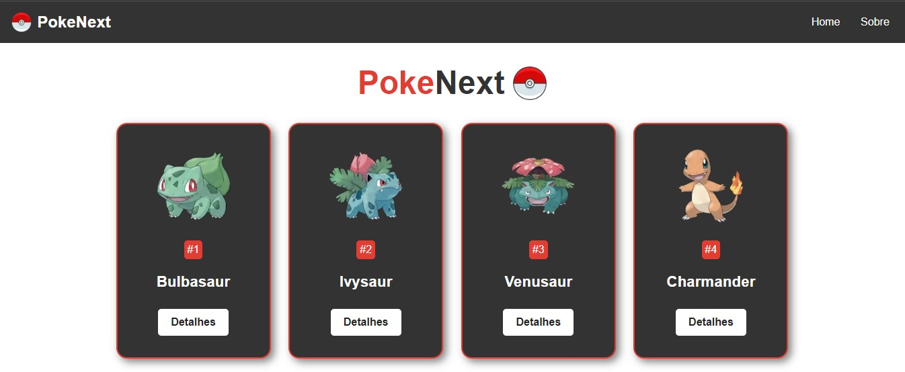

<h1 align="center"> PokeNext </h1>

  <a href="#-tecnologias">Tecnologias</a>&nbsp;&nbsp;&nbsp;|&nbsp;&nbsp;&nbsp;
  <a href="#-layout">Layout</a>&nbsp;&nbsp;&nbsp;|&nbsp;&nbsp;&nbsp;
  <a href="#memo-licença">Licença</a>

##Deploy 

  <a href="https://pokenext-opal.vercel.app/">PokeNext</a>

  

 

  

## 🚀 Tecnologias

Esse projeto foi desenvolvido com as seguintes tecnologias:

- NextJS
- Rotas dinâmicas
- Images
- Page Error 404
- Typescript

## 🔖 Iniciar o Projeto

`npm run dev`

## Acessar pagína:

`http://localhost:3000`

## Páginas dinâmicas:

`http://localhost:3000/pokemon/1`

## :memo: Licença

Esse projeto está sob a licença MIT.

